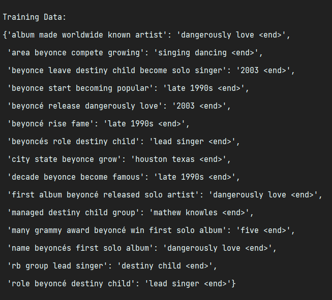
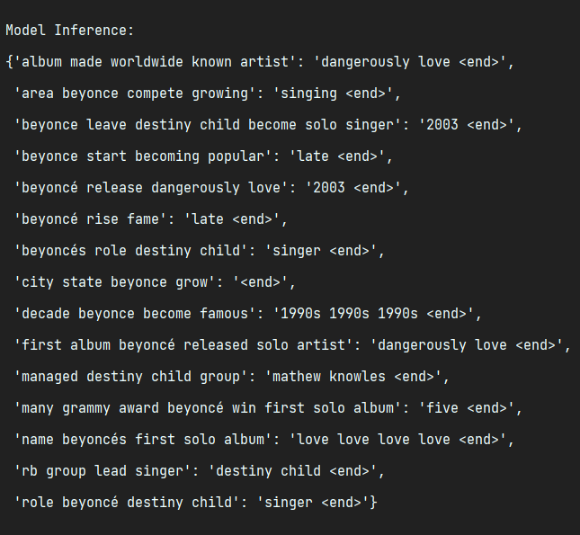

# GPT
A small example of the implementation of the gpt architecture

# Requirnments
    torch
    numpy
    nltk

# Examples
    Training data:

    Model prediction:

# Materials
* [preprocessing text](https://medium.com/@pawan329/text-data-preprocessing-made-easy-steps-to-clean-text-data-using-python-81a138a0e0e3)
* [basic model](https://medium.com/@sntaus/building-a-mini-gpt-like-language-model-from-scratch-27257bf5c145)
* [dataset](https://rajpurkar.github.io/SQuAD-explorer/) 
